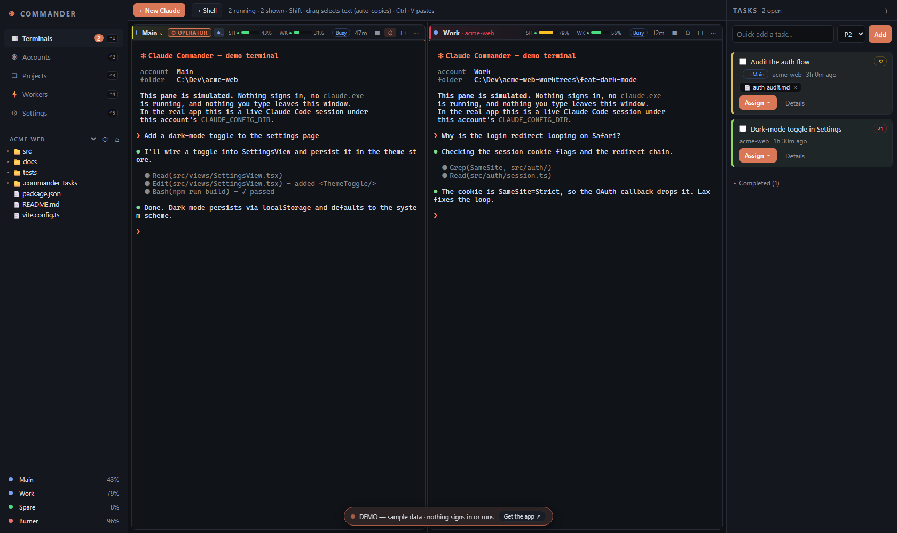

# Claude Commander

[](./LICENSE)
[](https://tauri.app)
[]()
[](./CONTRIBUTING.md)

> A local-first **operations center for [Claude Code](https://docs.anthropic.com/en/docs/claude-code)**, built for people running **multiple Claude accounts**. Every account auto-discovered with its live 5-hour/weekly usage always on screen, and one window to launch, warm up, fail over and delegate across all of them: sessions move between accounts with zero context loss, work fans out to whichever account has headroom, and Gemini/Codex join as first-class crew. Windows-first; **macOS & Linux builds in beta**.

**▶ [Try the live demo in your browser](https://rohanbeingsocial.github.io/claude-commander/)** — no install,
no sign-in: sample accounts and simulated terminals show every flow. Nothing runs and nothing you type goes anywhere.

## The idea: every Claude account you own, managed as one

If you run more than one Claude account, you know the drill: separate config dirs,
`CLAUDE_CONFIG_DIR` juggling, no idea which account has headroom, and a 5-hour limit that
always lands mid-task. Commander turns the pile of accounts into **one managed resource**:

- **Every account, discovered and measured** — `~\.claude` and `~\.claude-accounts\*` are
  found automatically, and every account gets live **5-hour %** and **weekly %** meters
  (real numbers from Claude Code's own status line, or honest estimates), reset
  countdowns, and a **best-pick hint** for where to launch next. Adding another account is
  one click, not folder surgery.
- **Limits stop mattering** — hit one and **failover** moves the live session, transcript
  and all, to the next account and resumes mid-conversation. **Auto-wake** relaunches
  limit-stuck sessions (and paused workers) the moment their window resets. **Warm-up**
  opens every account's 5-hour window up front for the price of one throwaway prompt each
  — on demand, on every launch, on app start, or whenever a window lapses.
- **Work spreads across accounts by itself** — an **operator** Claude delegates subtasks
  to headless **worker** Claudes on your other accounts (over the built-in local MCP
  server), so heavy execution drains many pools a little instead of one pool completely.
  **Autopilot** goes further: plan on the best-headroom account, implement on whichever
  account is best when the plan lands, reassign mid-phase — plan, progress and diff intact
  — whenever a limit strikes. Throughput scales with the **number of accounts**, not the
  size of one.
- **And you never lose track of any of it** — every pane wears its account, a stable peer
  id (`CC2.1` = account 2, instance 1) and a ◆ chip naming its task; delegated workers
  stream a live activity line; tasks, workers, pools and sessions persist in SQLite, so a
  crash or reboot brings the grid back as resumable cells.

The account roster isn't even Claude-only: **Gemini CLI** and **Codex CLI** accounts sit
beside your Claude accounts, run as first-class terminals, take delegated work, and join
**pools** — mixed-engine agent groups on one shared goal, with optional staged workflows
and review gates enforced by Commander.

Around that core: think *tmux + Terminator + Claude Code + task manager* in one native
window. Launch instances into repos and worktrees, and assign tasks (with linked markdown)
straight into a running Claude.

Built with **Tauri 2 (Rust) + React + SQLite + xterm.js/ConPTY**. No Electron, no cloud,
no telemetry — everything stays on your machine.

**Highlights**

- 👥 **All your accounts, one console** — auto-discovered, each with live 5-hour/weekly
  meters, reset countdowns, calibrating budgets and a best-pick hint; a new account slot
  is one click. No menu-diving to know where any account stands.
- 📊 **Usage always on screen** — every terminal header carries its account's live meters,
  its peer id and its task chip; delegated workers stream a live activity line.
- 🕹️ **Operator → workers over MCP** — type work into one Claude and it delegates subtasks
  to headless workers on your other accounts through a built-in, loopback-only MCP server.
- 🚦 **Autopilot** — hand Commander a task: it plans on one account, implements on another,
  and reassigns mid-phase when limits strike — the plan and progress survive every hop.
- ⛁ **Pools** — a crew of agents (Claude, Gemini, Codex — any mix) on one goal,
  coordinating through a shared plan/chat board, with optional staged workflows and
  review gates enforced by Commander.
- 🔁 **Zero-context-loss failover** — an account hits its limit and the session (transcript
  and all) moves to another account and resumes mid-conversation. **Auto-wake** relaunches
  limit-stuck sessions and paused workers the moment their window resets.
- 🛟 **Nothing gets lost** — crashed app? Workers are reconciled at boot and re-adoptable.
  Rebooted? The grid comes back as resumable cells. Limit mid-task? Progress, diff, and a
  resume handle survive.

---

## Contents

- [What it looks like](#what-it-looks-like)
- [Feature overview](#feature-overview)
- [Install](#install)
- [First run](#first-run)
- [Task delegation (Operator mode)](#task-delegation-operator-mode)
- [Autopilot](#autopilot-hands-free-plan-then-implement)
- [Pools](#pools-a-mixed-engine-crew-on-one-goal)
- [Features in depth](#features-in-depth)
- [Keyboard shortcuts](#keyboard-shortcuts)
- [Real usage vs. estimation](#real-usage-recommended)
- [How usage estimation works](#how-usage-estimation-works-fallback-honest-version)
- [Architecture](#architecture)
- [Data & safety](#data--safety)
- [Roadmap](#roadmap)
- [Docs · Contributing · License](#docs)

---

## What it looks like

The **terminal grid** — auto-tiling Claude terminals with per-account usage meters in every
header, the operator badge, the task board, and the file explorer (shown in demo mode —
[try it yourself](https://rohanbeingsocial.github.io/claude-commander/)):



The **Accounts** view — one card per account with live 5-hour/weekly meters, reset
countdowns, prompts-remaining estimates, and a best-pick hint (emails redacted):


And the overall layout:

```
┌────┬──────────────────────────────┬─────────────┐
│ na │  Claude 1        Claude 2     │  TASKS      │
│ v  │  ┌──────────┐   ┌──────────┐  │  ☐ audit…   │
│    │  │ 5h 42% ▓ │   │ 5h 8%  ▓ │  │  ☐ refactor │
│ ◉  │  └──────────┘   └──────────┘  │  📄 spec.md │
│ ❏  │  Claude 3        Claude 4     │  [Assign ▾] │
│ ⚙  │  ┌──────────┐   ┌──────────┐  │  ── done ── │
│    │  └──────────┘   └──────────┘  │  ~~shipped~~ │
└────┴──────────────────────────────┴─────────────┘
 sidebar        auto-tiled grid          task board
```

---

## Feature overview

| Area | What you get |
|---|---|
| 🖥️ **Terminal grid** | Auto-tiling grid of real Claude terminals (ConPTY + xterm.js) for 1, 2, 4, 6, 8+ instances. Maximize/restore panes; per-pane action menu. |
| 📊 **Live usage meters** | Every terminal header shows that account's **5-hour %** and **weekly %** as mini meters — usage always visible, never behind a menu. |
| 👥 **Multi-account** | Auto-discovers accounts from `~\.claude` + `~\.claude-accounts\*`; each instance runs under its own `CLAUDE_CONFIG_DIR`. **＋ Add account** in Settings creates a fresh login slot in one click — no hand-made folders. |
| 📋 **Task board** | Permanent, resizable panel. Quick-add tasks, drag `.md` files to link them, **Assign ▾** to inject a task into a running Claude. You control completion. |
| 🕹️ **Task delegation** | Run a Claude as an **Operator** that delegates subtasks to worker accounts (headless `claude -p`) — hands-on from the **Workers** tab, or hands-off via the built-in **local MCP server** (`delegate`, `poll`, `collect`, …). Every running worker shows a **live activity line**; a limit-hit worker keeps its progress and is resumable or reassignable. |
| 🚦 **Autopilot** | Hand the app a task and it runs the whole pipeline itself: **plan** on the best-headroom account, then **implement** on whichever account is best when the plan lands — reassigning mid-phase (plan, progress and diff intact) whenever a limit strikes. Watch phases, read the plan, or stop the run from the **Workers** tab. |
| 🧩 **Multi-engine** | **Gemini CLI** and **Codex CLI** run as first-class terminals and delegation workers beside your Claudes — one grid, one workflow across models. Register engine accounts in one click; Commander auto-detects the CLIs. |
| ⛁ **Pools** | Group any mix of Claude / Gemini / Codex agents into a **pool** with one goal: each member runs as a visible terminal and they coordinate through a shared **plan / chat / result board**. Commander nudges members when the board changes, revives limit-stuck ones, and can enforce an ordered **work → review** workflow with revision loops. |
| 🪪 **Peer identity** | Every instance knows who it is and who else is open in the same folder: a stable `CC2.1`-style id (account 2, instance 1) shown on its tile and exposed over MCP to **every** instance (`whoami`, `peers`, `message_peer`) — instances can message each other, but only when you ask them to. |
| 🔁 **Failover** | On a usage-limit message, copies the session transcript to another account and relaunches with `--resume` — zero context loss. An operator's orchestrator role (MCP token + worker pool + running workers) survives the move. |
| ⏰ **Auto-wake** | Opt-in: a session stuck at its usage limit relaunches itself (`--continue` + a nudge prompt) the moment the window resets — and a second toggle resumes **paused workers** from their saved progress the same way. Unattended machines pick work back up on their own. |
| ⏱️ **Session warm-up** | The 5-hour window only opens on an account's *first message* — so open them all up front: one click sends a throwaway prompt via headless `claude -p` (haiku) to each enabled account and kills it at the first reply. Every timer running, almost no tokens spent. Fire it on demand, on every launch, on app start, or whenever a window lapses (**keep windows open**). |
| 🛟 **Crash recovery** | Worker bookkeeping is reconciled at boot after a crash, and a relaunched operator can **adopt** orphaned workers (and their progress) instead of losing them. |
| 📁 **File explorer** | Sidebar file tree with a **root switcher** (any registered project, the active terminal's folder, or a custom folder), a ⟳ refresh that doesn't collapse the tree, and drag-any-file-onto-a-task linking. |
| 💻 **Plain terminals** | Launch a plain PowerShell pane into the same grid, with the chosen account's `CLAUDE_CONFIG_DIR` preloaded — for git, builds, and quick checks beside your Claudes. |
| 🎬 **Demo mode** | One click fills the app with sample accounts (Claude, Gemini *and* Codex), tasks, workers, an autopilot run, a staged pool and simulated terminals so you can explore every flow **without Claude Code installed or any account signed in**. Nothing runs, nothing is written; exit restores your real data. |
| 🧠 **Project memory** | Auto-maintained `.project-memory\*.md` (summary, architecture, decisions, todos, handover, session-log) folded into handovers. **Shared memory** (default on): every account's Claude memory for a project points at one store in `.project-memory\memory`, entries signed with the writer's peer id — switch accounts without losing what the last one learned. |
| 🌿 **Worktrees** | Create / launch / remove git worktrees under `<repo>-worktrees\<branch>` straight from the UI. |
| 💾 **Session recovery** | The grid is persisted (SQLite). After a crash/reboot, terminals reappear as **Resume** cells (`claude --continue`). |
| ⌨️ **Keyboard-driven** | Ctrl+1…5 views, Ctrl+B sidebar, Ctrl+J task panel, Ctrl+N new instance; terminal copy/paste. |
| 🔌 **Real usage tap** | Optional, reversible tap into Claude Code's status line for **LIVE** rate-limit numbers with true reset countdowns. |

---

## Install

**Windows** is the primary, battle-tested platform. **macOS and Linux builds are in beta** —
the whole codebase compiles and passes tests on both in CI, and installers ship with every
release, but they've had little time on real hardware yet. Issue reports are gold.

Everyone needs [Claude Code](https://docs.anthropic.com/en/docs/claude-code) on `PATH`
(`claude --version`); if it isn't found, set the exact path in **Settings → Claude executable**.

### Option A — download an installer (fastest)

Grab the latest build for your OS from
[**Releases**](https://github.com/rohanbeingsocial/claude-commander/releases):

| OS | Asset | First-run note |
|---|---|---|
| **Windows 10/11 x64** | `Claude Commander_<v>_x64-setup.exe` | SmartScreen may warn (unsigned) — **More info → Run anyway**. Needs WebView2 (ships with Win 11; [runtime for Win 10](https://developer.microsoft.com/microsoft-edge/webview2/)). |
| **macOS — Apple Silicon** *(beta)* | `Claude Commander_<v>_aarch64.dmg` | Unsigned — **right-click the app → Open** the first time (or `xattr -cr "/Applications/Claude Commander.app"`). |
| **macOS — Intel** *(beta)* | `Claude Commander_<v>_x64.dmg` | Same as above. |
| **Linux** *(beta)* | `claude-commander_<v>_amd64.AppImage` or `.deb` | `chmod +x` the AppImage; needs WebKitGTK 4.1 (Ubuntu 22.04+). |

> **Just want a look?** Open the **[live web demo](https://rohanbeingsocial.github.io/claude-commander/)** —
> nothing to install. The installed app has the same thing built in: click **Try demo mode**
> (or **Settings → Demo mode**) to explore with sample accounts and simulated terminals —
> nothing signs in, nothing runs, nothing you type goes anywhere.

### Option B — build from source

Claude Commander is a native desktop app (Tauri = a Rust binary + a web UI). A first build
takes about 10 minutes end-to-end (Rust compiles a lot the first time; later builds are
fast).

#### 1. Install the prerequisites

The table below is the **Windows** toolchain. On **macOS** you need the Xcode Command Line
Tools (`xcode-select --install`) plus Node and Rust; on **Linux**, Node, Rust and the
WebKitGTK stack: `sudo apt install libwebkit2gtk-4.1-dev build-essential libxdo-dev
libssl-dev libayatana-appindicator3-dev librsvg2-dev` (see
[Tauri 2 prerequisites](https://v2.tauri.app/start/prerequisites/) for other distros).

| Need | How | Verify |
|---|---|---|
| **Node.js 18+** (includes npm) | [nodejs.org](https://nodejs.org/) → LTS installer | `node -v` |
| **Rust (stable)** | [rustup.rs](https://www.rust-lang.org/tools/install) → run `rustup-init.exe`, accept defaults | `cargo --version` |
| **MS C++ Build Tools** | [Visual Studio Build Tools](https://visualstudio.microsoft.com/visual-cpp-build-tools/) → check **"Desktop development with C++"** | (linker used by `cargo`) |
| **WebView2 runtime** | Ships with Windows 11; on Windows 10 grab the [Evergreen runtime](https://developer.microsoft.com/microsoft-edge/webview2/) | Edge installed = present |
| **Claude Code** | [Install guide](https://docs.anthropic.com/en/docs/claude-code) — must be on your `PATH` | `claude --version` |

> Full details for the native toolchain: [Tauri 2 Windows prerequisites](https://v2.tauri.app/start/prerequisites/).
> The one people miss is the **C++ Build Tools** — without them `cargo` can't link and the
> build fails at the very end.

#### 2. Clone & build

```bash
git clone https://github.com/rohanbeingsocial/claude-commander.git
cd claude-commander
npm install                  # frontend deps (fast)
npm run tauri build          # compiles the Rust core + UI → a single .exe
```

The result lands at:

- **Installer:** `src-tauri\target\release\bundle\nsis\Claude Commander_<version>_x64-setup.exe`
- **Portable exe:** `src-tauri\target\release\claude-commander.exe`

Run the installer for Start-menu/taskbar integration, or just double-click the portable
`.exe`. (`npm run tauri build -- --no-bundle` skips the installer and only produces the
`.exe`.)

#### 3. Run it

Launch **Claude Commander** from the Start menu (if you ran the installer) or double-click
`claude-commander.exe`. On first run it auto-discovers your Claude accounts — see
[First run](#first-run) below.

#### Develop (hot-reload)

```bash
npm run tauri dev            # hot-reloading dev build; changes to the UI reload live
```

#### Troubleshooting the build

- **`link.exe not found` / linker errors** — the C++ Build Tools aren't installed (or you
  didn't tick "Desktop development with C++"). Install them, then reopen your terminal.
- **`cargo` not recognized** — restart your terminal after installing Rust so `PATH`
  picks up `~/.cargo/bin`.
- **App opens but terminals say `claude` not found** — Claude Code isn't on `PATH`. Fix
  your `PATH`, or set the exact path in **Settings → Claude executable → Browse…**.
- **First build is slow** — normal; Rust compiles all dependencies once. Subsequent builds
  reuse the cache and take seconds.

---

## First run

1. **Accounts** are auto-discovered from `~\.claude` (shown as **Main**) and every folder
   in `~\.claude-accounts\*` — the same config dirs your `cc`/`ccw` scripts use. Instances
   launch with `CLAUDE_CONFIG_DIR` pointed at the chosen account.
   - **Adding another account (e.g. a fresh machine):** open **Settings → Accounts** and
     click **＋ Add account**. That creates an empty config slot under
     `~\.claude-accounts\<n>`; launch a Claude instance on it (**+ New Claude**) and sign in
     when Claude Code prompts. You now have a second account running in the grid — no need to
     create folders by hand and re-scan. **Add folder…** registers a config dir you already
     have, and **Re-discover** re-scans for any added outside Commander.
2. **Usage history** is parsed from each account's session transcripts on first scan
   (~seconds). Numbers sharpen as budgets calibrate (see below).
3. **Projects** — add your repos in the Projects view (folder picker). Worktrees are
   created under `<repo>-worktrees\<branch>` next to the repo.

---

## Task delegation (Operator mode)

Instead of one Claude doing everything on one account, run a Claude as an **Operator** that
delegates subtasks to **worker** Claudes on your *other* accounts. Workers run **headless**
(`claude -p --output-format stream-json`), each in the same repo. Because the heavy
execution is fanned out across several accounts, no single account's 5-hour window drains
fast — and the operator itself does little token volume (plan, dispatch, read summaries).

> The idea: a capable model plans and hands work down to cheaper models — but across
> **different accounts**, so your limits don't hit as quickly.

### Turning it on

Two ways, both storing the same per-instance config:

- **At launch** — in **+ New Claude**, tick **"Make this an orchestrator"** and check the
  worker accounts to delegate to.
- **On a running pane** — click the **⚙ gear** in any terminal header to open its **Operator
  settings**:
  - **Operator** — delegate the work given to this instance to the accounts below (or itself).
  - **Delegation accounts** — the worker pool (your other enabled accounts).
  - **Use agents within the operator usage pool** — also let the operator use its *own*
    subagents for some tasks. **Off by default** (pure delegation).

  When on, an **⚙ OPERATOR** badge shows in that pane's header.

### The Workers tab

The **Workers** view (Ctrl+4) is the delegation console:

- **Delegate a task** — pick a worker account (Claude, Gemini or Codex — the model list
  adapts to the engine), a working directory, and a prompt. The worker launches headless
  with the operator's context.
- **Watch workers live** — status per worker (running / done / paused at limit / failed),
  plus a **live activity line** showing what each running worker is doing *right now*;
  click it for the full streaming feed.
- **Closure report** — open any worker to see its **progress** (its own `progress.md`, or a
  summary distilled from the output stream), its **result**, the **working-tree diff**, its
  **resume handle**, and the account's **reset time**.
- **Stop / Reassign** — kill a worker, or hand its remaining work to another account.
- **Check real usage** — reads each account's **real** 5h/weekly numbers straight from
  Claude Code's status line (not Commander's estimate).
- **Autopilot panel** — assign a task to the
  [autopilot pipeline](#autopilot-hands-free-plan-then-implement), watch its phase badges,
  read the harvested plan, or stop the run.

Each worker gets its own folder under the repo:
`.commander-tasks\<id>-<slug>\{prompt.md, context.md, progress.md, stream.jsonl, result.md}`.

### Progress is never lost

A worker that hits a usage limit **does not lose its work**. On any stop, Commander writes a
**closure report** so the operator always learns how far it got, and:

- **Pause & report (default)** — the worker is marked *paused at limit* with its progress,
  diff, resume handle and reset time; nothing else happens until you decide.
- **Auto-reassign (opt-in)** — turn on **Settings → Auto-reassign delegated workers** and
  Commander hands the remainder (progress + diff as context) to the best-headroom worker
  account automatically.

Either way the on-disk changes, `progress.md`, and the resumable session all survive, so the
work can be continued on the same account after reset, reassigned to another account, or
picked up by you.

### The MCP channel (hands-off delegation)

Commander itself runs a **local, loopback-only MCP server**, and **every** Claude launch —
not just operators — gets a per-session bearer token and a private `--mcp-config`. All
instances get the identity tools: `whoami` (who am I), `peers` (who else is open — pass
`all_folders` to look beyond this folder) and `message_peer` (type a signed note into
another instance's terminal — used only when you ask). Operators additionally get the
delegation set — `workers_list`, `workers_usage`, `delegate`, `poll`, `collect`,
`broadcast_context`, `adopt_workers` — plus the autopilot controls (`assign_task`,
`assignments_status`, `stop_assignment`): thirteen tools in all. So you can simply *type
work into the operator* and it delegates on its own. Delegation tools are refused
server-side for non-operators, every call is scoped to that operator's worker pool, tokens
die with the session, and nothing is exposed beyond localhost.

Delegation also survives the bad days:

- **Operator hits its limit** → failover carries the orchestrator role along: a fresh MCP
  token is minted for the successor, the pool is copied over, and the old instance's
  running workers are re-parented onto it.
- **Commander crashes mid-run** → worker bookkeeping is reconciled at next boot (a
  `result.md` on disk means *done*, otherwise *stopped*), and a relaunched operator can
  call `adopt_workers` to take over orphaned workers and their progress.

Full architecture and guarantees: [docs/ORCHESTRATION.md](docs/ORCHESTRATION.md).

---

## Autopilot (hands-free plan-then-implement)

Task delegation still leaves someone — you, or an operator Claude — choosing accounts.
**Autopilot** removes even that: describe a task in the **Workers** tab (or let an
operator call the `assign_task` MCP tool) and Commander runs the whole pipeline itself:

1. **Phase 1 — plan.** The task goes to the account with the most real headroom, with
   planning-only instructions; the deliverable is an implementation plan written to
   `plan.md`, which Commander harvests.
2. **Phase 2 — implement.** A fresh worker — on whichever account is best *at that
   moment*, often a different one — implements exactly that plan.

Every hop is survivable: if a worker hits a usage limit or dies mid-phase, the remainder
is reassigned automatically with the plan, the progress checkpoint and the diff carried
along; if *no* account has headroom, the assignment parks and resumes the moment a window
frees. The Workers tab shows each assignment's phase badge, hop count and current account,
with buttons to read the plan or stop the run.

---

## Pools (a mixed-engine crew on one goal)

Delegation is a hierarchy — one operator, many workers. A **pool** is a peer group: pick a
folder, write a goal, and add members — each one any account with its own model, so "three
Fables", or "Fable + Gemini Pro + Codex", whatever the job wants (**Pools** view, Ctrl+5).

**Start** launches every member as a visible terminal in the grid with a briefing:
coordinate through the shared board in `.commander-pool\<id>\` — divide the work in
`plan.md`, talk in `chat.md`, and the last finisher writes `result.md`, which marks the
pool done. Open the board viewer at any time to read the plan, the chat and the result, or
nudge any member by hand.

Commander is the crew's **pump and medic**: a 10-second tick watches the board and types a
nudge into members when it changes, relaunches limit-stuck members the moment their window
resets (`--continue` for Claudes; other engines are re-briefed after the cool-down), and
tells healthy peers to pick up a stuck member's tasks so the goal keeps moving.

### Staged workflows (review gates)

Without stages, members self-organize around the goal. Add **ordered stages** and
Commander enforces a pipeline instead: exactly one member works at a time, each stage has
an owner and optional instructions, and a **review** stage cross-questions the previous
stage's author — and can send the work back. The revision loop runs until the reviewer
approves, all automatic. A one-click template sets up the classic ruleset: **A plans →
B reviews (revisions loop back to A) → C implements**.

---

## Features in depth

### 🖥️ Terminals (home screen)

A live, auto-tiling grid of Claude terminals (ConPTY + xterm.js) for 1, 2, 4, 6, 8+
instances. Every terminal header shows that account's **5-hour %** and **weekly %** (mini
meters), status, and session duration — usage is always visible. Maximize/restore a pane;
a per-pane menu offers handover, failover, open folder, external terminal, and
kill/close. **`+ New Claude`** picks account + repo + worktree (or creates one) + an
optional opening prompt.

### 📋 Task board (permanent right panel)

Quick-add tasks; drag `.md` files onto a task to link references (audits, architecture,
PRDs…); **Assign ▾** composes `Task: … / Reference files: @file…` and sends it straight
into a running terminal. **Completion is yours alone** — Claude finishing doesn't tick the
box. Check it yourself and the task strikes through and drops into a searchable
**Completed** section. You can also **Start** a task, which launches a fresh instance on
the chosen account with the task pre-loaded.

Each task gets a distinct accent color (card stripe + tint), and an assigned task shows a
**◆ name chip** in its terminal's header so you always know which pane is doing what.
Every task also gets a folder — `<repo>\.commander-tasks\<id>-<slug>\{prompt.md, progress.md}` —
and Claude keeps `progress.md` updated, viewable from the task's Details.

### 👥 Accounts

One card per account showing status, the 5-hour window with a reset countdown, rolling
7-day usage, estimated prompts remaining, a confidence chip, and a "best pick" hint for
where to launch next.

### 🔁 Failover

When a terminal prints a usage-limit message, the app marks the account, calibrates its
budget from the observed usage, generates a handover, **copies the session transcript into
the next account's config dir**, and relaunches with `--resume <session-id>`. Context is
preserved — the same mechanism as `/move`. Auto (default on) or one click from the pane
menu. If the instance was an operator, its orchestrator role moves too — fresh MCP token,
same worker pool, workers re-parented onto the successor.

### ⏰ Auto-wake

**Settings → Auto-wake on limit reset** (off by default): when a session is stuck at its
usage limit and wasn't failed over, the background scanner relaunches it on the same
account with `claude --continue` plus a nudge prompt the moment the window resets.
A second toggle, **Auto-wake paused workers**, does the same for delegated workers parked
at their limit — they resume on the same account from their saved progress, not from
scratch. Combined with auto-reassign for delegated workers, an unattended machine picks
its work back up on its own — start something before bed, wake up to it finished.

### ⏱️ Session warm-up

Claude's 5-hour window opens on an account's **first message** — an untouched account's
timer doesn't start until you need it, which is exactly the wrong moment. Warm-up opens
the window early: for each enabled account whose window is closed, Commander runs a
headless `claude -p` (haiku — the cheapest model), sends a single throwaway prompt, and
**kills the process the instant the first reply arrives**. A few tokens per account, and
every timer is running.

Use **Settings → ⏱ Warm up all accounts now**, or turn on **Auto warm-up** to do it
automatically whenever you launch a Claude. Accounts already in a window, at a limit, or
warmed in the last 10 minutes are skipped.

Two more switches take it further: **Warm up on app start** opens every enabled account's
window the moment Commander launches, and **Keep windows open** re-opens an account's
window whenever it lapses (~5×/day per account, one throwaway haiku prompt each time — it
uses the status-line tap's live data, so it only fires when a window really closed rather
than the account being signed out).

### 📁 File explorer

A collapsible file tree in the sidebar. Its header is a **root switcher** — flip between
any registered project, the active terminal's folder, or a custom folder — and the ⟳
refresh re-reads expanded folders without collapsing the tree. Drag any file onto a task
to link it as a reference.

### 💻 Plain terminals

The launch modal can spawn a **plain PowerShell pane** instead of a Claude — same grid,
same per-account context (`CLAUDE_CONFIG_DIR` preloaded), no limit detection. For git,
test runs, and quick checks right next to the Claude doing the work.

### 🧩 Multi-engine (Gemini & Codex)

The launch modal offers **Gemini CLI** and **Codex CLI** beside Claude and PowerShell —
each opens as a first-class grid terminal. Register engine accounts from **Settings →
＋ Add Gemini / ＋ Add Codex** (Gemini auth lives globally in `~/.gemini`; each Codex
account gets its own `CODEX_HOME`), and point Commander at the executables under
**Settings → CLI executables** — leave them empty and they're auto-detected from `PATH`
and common install dirs.

Engine accounts take delegated work from the Workers tab (the model picker adapts to the
engine) and join pools as members. They don't get usage meters — the Gemini/Codex CLIs
don't publish rate-limit windows — so failover and warm-up stay Claude-only.

### 🪪 Peer identity

Every non-shell launch is minted a stable peer id — `CC<account>.<n>`, so `CC2.1` is
account 2, instance 1 — shown on its grid tile and kept for the life of the session. Over
the MCP server every instance can call `whoami` (its own id, folder and peers), `peers`
(everything open in this folder — or everywhere, with `all_folders`) and `message_peer`,
which types a **signed note directly into another instance's terminal**. Instances only
message each other when you ask them to — the tools exist so *you* can wire up
multi-instance workflows, not so they can chat on their own.

### 🧠 Project memory (shared across accounts)

`.project-memory\{summary,architecture,decisions,todos,handover,session-log}.md`,
auto-created and folded into handovers. Editable under **Projects → Memory**.

**Shared memory** (default on) goes further. Each account's *Claude memory* for a project
normally lives inside that account's config dir — switch accounts and the new Claude
remembers nothing. With sharing on, every account's memory path for the folder points at
one store inside the project itself (`.project-memory\memory`), so all accounts load and
write the same `MEMORY.md` — and it survives crashes, reboots and account switches. Each
account's private memory is merged in on first launch (the original kept as
`memory.pre-shared`), and instances sign new entries with their peer id, so you can see
which account learned what.

### 🌿 Worktrees

Create / launch / remove git worktrees under `<repo>-worktrees\<branch>` directly from the
Projects view — branch list included, no shell juggling. Each worktree shows a color dot
matching its terminal's header stripe, plus chips for the live instances running in it.

### 💾 Session recovery

The grid *is* your persisted working set (SQLite). After a crash or reboot, previous
terminals reappear as **Resume** cells (`claude --continue`, same folder + account). Tasks,
links, projects and worktrees all persist.

---

## Keyboard shortcuts

| Keys | Action |
|---|---|
| Ctrl+1…6 | Terminals / Accounts / Projects / Workers / Pools / Settings |
| Ctrl+B | Cycle sidebar: expanded → icons → hidden |
| Ctrl+J | Toggle the task panel |
| Ctrl+N | New Claude instance |
| Ctrl+V · Ctrl+Shift+V · Shift+Insert | Paste into the focused terminal |
| Ctrl+Shift+C | Copy the terminal selection |
| Ctrl+C | Copy when text is selected, otherwise send interrupt (^C) |
| Right-click | Copy the selection if any, otherwise paste |

On macOS, **Cmd** works wherever Ctrl is listed. Terminal copy/paste goes through the OS
clipboard directly (Tauri's clipboard layer), so it works reliably inside the WebView —
and paste respects Claude Code's bracketed-paste mode, so multi-line pastes land intact.

---

## Real usage (recommended)

Claude Code passes each account's **real** 5-hour and weekly rate-limit percentages into
its status line. **Settings → "Use real usage from Claude Code's status line"** installs a
tiny, dependency-free tap into every account (chaining any status line you already run, so
your display is unchanged). It records those numbers to `<config>\commander-statusline.json`;
Commander then shows **LIVE** figures with real reset countdowns instead of the estimate
below. Numbers appear once each account has run one Claude session (rate limits arrive
after the first API response). Off by default; fully reversible from the same toggle.

## How usage estimation works (fallback, honest version)

Claude doesn't expose limit APIs, so the app measures what Claude Code writes to disk:
per-message token counts in `<config>\projects\*\*.jsonl`. These aggregate into
**weighted tokens** (`input + 5·output + 0.1·cache-read + 1.25·cache-write`, ×5 for
opus/fable-class, ×⅓ for haiku) against per-account budgets:

- Budgets start as plan presets (editable in Settings).
- The moment an account genuinely hits a limit, the observed window usage **becomes**
  the budget (auto-calibration) — accuracy improves with use.
- The 5-hour window is simulated the way Claude actually runs sessions (first message
  opens a window; reset time shown). The weekly number is a rolling 7-day sum because
  Anthropic doesn't expose its weekly anchor.

Treat the percentages as good estimates, not gospel — the *Confidence* chip tells you
how much to trust each card.

---

## Architecture

One `.exe`: a Tauri 2 shell hosting a React/TypeScript UI in WebView2, talking to a Rust
core over `invoke`/events. No async runtime — the main thread, one background thread
(usage scan + auto-wake + warm-up + autopilot heartbeat), a pump tick per running pool,
a monitor thread per headless worker, and two short-lived threads per running PTY.

```
┌───────────────── claude-commander.exe (Tauri 2) ─────────────────┐
│  WebView2 (React + TS)          invoke/events   Rust core        │
│  ┌──────────────────────┐  ◄──────────────────► ┌──────────────┐ │
│  │ Terminals · Accounts │                        │ accounts     │ │
│  │ Projects · Tasks     │                        │ usage · pty  │ │
│  │ Workers · Pools      │                        │ git·handover │ │
│  │ Settings             │                        │ failover·db  │ │
│  └──────────────────────┘                        │ orchestration│ │
│                                                   │ pools·mcp    │ │
└──────────────────────────────────────────────────┴──────────────┘
        │                          │                       │
        ▼                          ▼                       ▼
 %APPDATA%\...\commander.db   ~\.claude*\...\*.jsonl   claude.exe (ConPTY)
 (SQLite, WAL)               (read-only usage source)  one PTY per instance
```

| Layer | Tech |
|---|---|
| Shell / native | Tauri 2, Rust (`rusqlite`, `portable-pty`, `chrono`, `dirs`) |
| Frontend | React 18, TypeScript, Zustand, `react-mosaic-component`, `react-dnd` |
| Terminals | xterm.js + `@xterm/addon-fit` over Windows ConPTY |
| Storage | Bundled SQLite (WAL) at `%APPDATA%\com.rohan.claudecommander\commander.db` |

- **Multi-account mechanism** — each instance is spawned with `CLAUDE_CONFIG_DIR` pointed
  at that account's config dir; the same trick the `cc`/`ccw` scripts use.
- **Failover mechanism** — locate the newest `<uuid>.jsonl` for the instance's cwd under
  the source account, copy it (+ matching todo files) into the target account's identical
  path, kill the old PTY, and spawn `claude --resume <uuid>` under the target's config.
- **Delegation mechanism** — an operator delegates to a worker by spawning a headless
  `claude -p --output-format stream-json` process under the worker account's
  `CLAUDE_CONFIG_DIR`, in its own `.commander-tasks\<id>-<slug>\` folder. A monitor thread
  captures the stream (feeding the live activity line), detects limits, and writes a
  closure report on exit; usage/reset numbers come from the status-line tap. Gemini/Codex
  workers spawn their own headless CLIs the same way. See
  [docs/ORCHESTRATION.md](docs/ORCHESTRATION.md).
- **Pool mechanism** — each pool member is a normal grid instance launched with a briefing;
  a 10-second tick reads the shared board (`.commander-pool\<id>\{plan,chat,result}.md`),
  types nudges into members when it changes, enforces the staged workflow's review gates,
  and revives limit-stuck members when their window resets.

See [docs/DESIGN.md](docs/DESIGN.md) for the full IPC surface, DB schema, and build order.

---

## Data & safety

- App state lives in `%APPDATA%\com.rohan.claudecommander\commander.db` (SQLite).
- The app only ever **reads** account config dirs, **except** during failover (it copies one
  session `.jsonl` + its todo file into the target account's dir) and the optional usage tap.
- Delegated workers write only inside the repo's `.commander-tasks\` folders and run under the
  worker account you selected; they're plain `claude -p` processes and are killed on stop/exit.
  Pools keep their coordination board inside the repo too, under `.commander-pool\`.
- Killing an instance kills the `claude` process; closing the app kills all of them.
- No cloud, no telemetry — nothing leaves your machine.
- `claude` processes are ~150–250 MB each (that's Claude Code, not the app).

---

## Roadmap

- **macOS & Linux hardening** — beta builds ship with every release (CI-built and tested,
  unsigned). Terminals, delegation and failover need real-hardware mileage — feedback and
  issues are very welcome.
- **More engines** — Gemini and Codex already run as terminals, delegation workers and
  pool members; the engine layer is built for whatever CLI comes next.
- **Richer pool workflows** — referee verdicts and smarter stage orchestration on top of
  the existing work/review pipeline.
- Signed installers.
- Smarter delegation scoring (task priority/complexity fields are already stored for it).

## Docs

- [docs/AUDIT.md](docs/AUDIT.md) — what was cut from the original spec and why.
- [docs/DESIGN.md](docs/DESIGN.md) — architecture, DB schema, IPC surface, build order.
- [docs/ORCHESTRATION.md](docs/ORCHESTRATION.md) — task delegation across accounts (operator → workers) with progress preservation: architecture, current status, and the pending MCP layer.

## Contributing

Issues and PRs welcome. See [CONTRIBUTING.md](./CONTRIBUTING.md) for how to set up a dev
build and what to include in a report. Good first areas: cross-platform support
(macOS/Linux), usage-estimation accuracy, and the task board.

## License

Licensed under the [Apache License 2.0](./LICENSE). See [NOTICE](./NOTICE).

## Disclaimer

Independent, unofficial tool. Not affiliated with or endorsed by Anthropic. "Claude" and
"Claude Code" are products of Anthropic. Usage percentages are **estimates** derived from
local session data — treat them as guidance, not billing truth.
